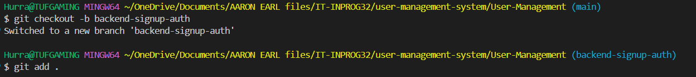
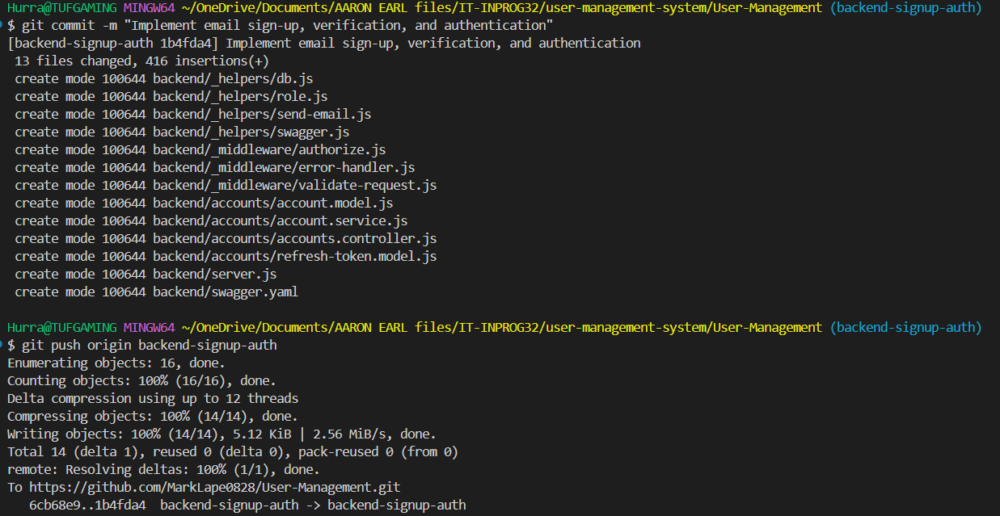
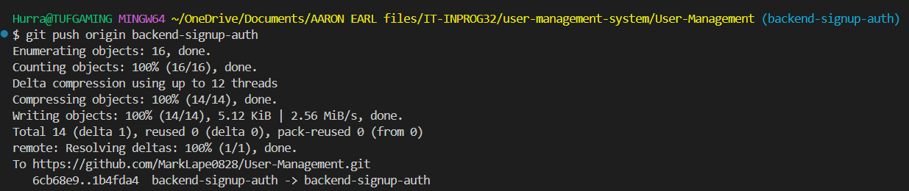
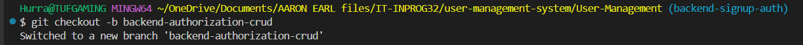
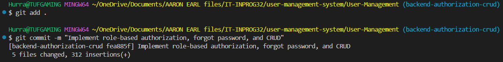
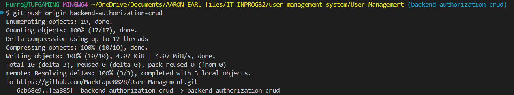
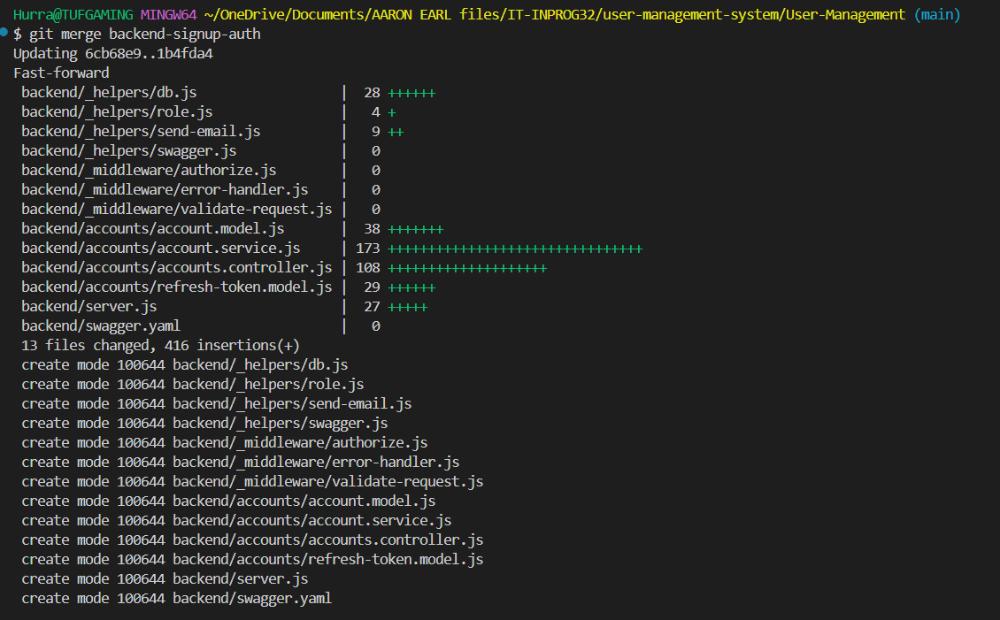
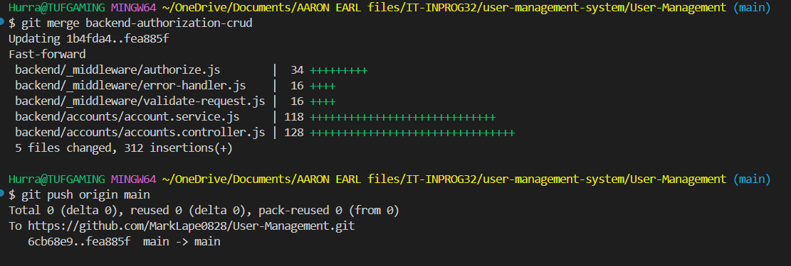

# User Management

Collaboration Workflow
Backend Development
1.Developer 1: Email Sign-Up, Verification, and Authentication

2.Developer 2: Role-Based Authorization, Forgot Password, and CRUD

Submit a Pull Request (PR) to merge into main.

